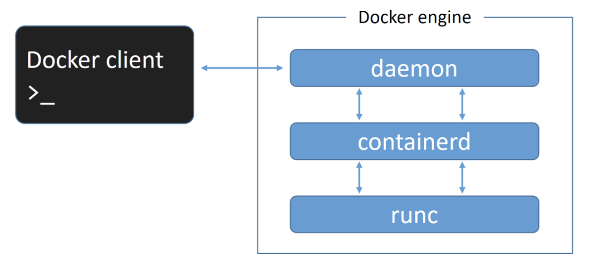
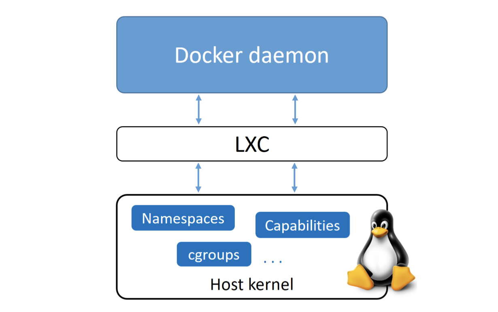
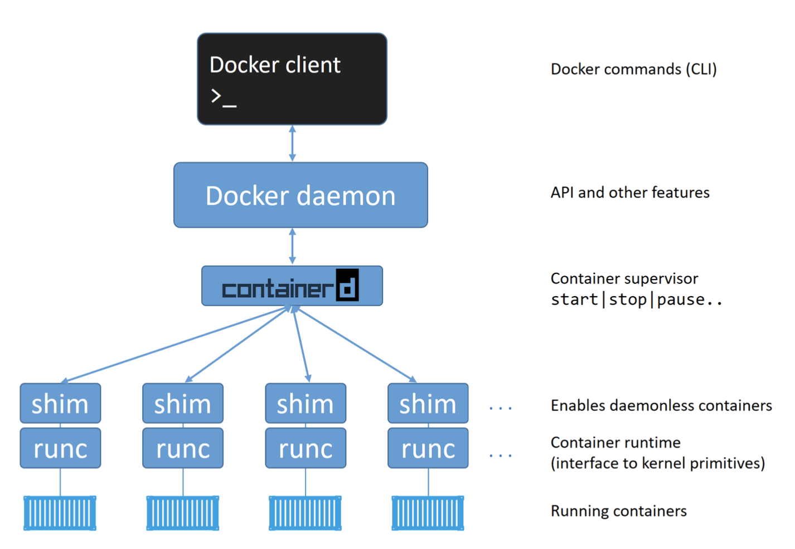

## **05: The Docker Engine**

### **The Docker Engine**

- The Docker engine is **_the core software that runs and manages containers_**.

- modular in design with many swappable components.

- the Docker Engine is like a car engine

- both are modular and created by connecting many small specialized parts:

- A car engine is made from many specialized parts that work together to make a car drive

- TheDockerEngineismadefrommanyspecializedtoolsthatworktogetherto create and run containers — APIs, execution driver, runtime, shims etc.

- the major components that make up the Docker engine are:
- the Docker client,
- the Docker daemon,
- containerd, and runc.
- Together, these create and run containers.



---

### **The Deep Dive**

- At first released

- the Docker engine had two major components:

  - The Docker daemon

  - LXC

- The Docker daemon was a monolithic binary.

- It contained all of the code for

  - the Docker client,
  - the Docker API,
  - the container runtime,
  - image builds, and much more.

- LXC provided the daemon with access to

- the fundamental building-blocks of containers
  that existed in the Linux kernel.

  - like namespaces and control groups (cgroups).

#### **Old Docker Version**

- the daemon, LXC, and the OS, interacted in older versions of Docker.

  

---

### **Getting rid of LXC**

- The reliance on LXC was an issue from the start.

- First up, LXC is Linux-specific.

  - A problem for a project that had aspirations of being multi-platform.

- Second up, being reliant on an external tool for something so core to the project was a huge risk that could hinder development.

### libcontainer

- developed their own tool **libcontainer**as a replacement for LXC.

  - to be a platform-agnostic tool that provided
    Docker with access to the fundamental container building-blocks that exist inside the kernel.
  - replaced LXC as the default execution driver in Docker 0.9.

---

### **Getting rid of the monolithic Docker daemon**

- became more and more problematic:

  - It’s hard to innovate on.

  - It got slower.

  - It wasn’t what the ecosystem (or Docker, Inc.) wanted.

### huge effort

- to break apart the monolithic daemon and modularize it.

- re-implement it in smaller specialized tools.

- all of the container execution and container runtime code entirely removed from the daemon

- and refactored into small, specialized tools.

Figure : _a high-level view of the current Docker engine architecture with brief descriptions_



---

### **Starting a new container**

- creating a new container.
- start a simple new container based on the alpine:latest image.

```shell
$ docker container run --name ctr1 -it alpine:latest sh
```

- the Docker client converts them into the appropriate API payload and POSTs them to the correct API endpoint.
- the daemon receives the command to create a new container, it makes a call to containerd.
- The daemon communicates with containerd via a CRUD-style API over gRPC.
